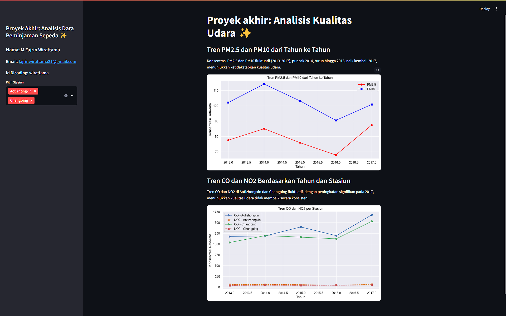

# Submission Dicoding "Belajar Data Analytics dengan Python"

## Project Data Analytics

Pada repository ini berisikan proyek data analytics yang saya kerjakan.

## Deskripsi

Proyek ini bertujuan untuk mengevaluasi tren kualitas udara berdasarkan konsentrasi CO dan NO2 di stasiun Aotizhongxin dan Changping, serta mengidentifikasi pola fluktuasi dan faktor yang memengaruhi perubahan kualitas udara selama periode 2013-2017, sehingga analisis dapat berguna dalam memahami perkembangan polusi udara erapa tahun terakhir sebagi upaya perbaikan kualitas udara di masa depan.

## Struktur Direktori

- **/data**: pada direktori ini berisi data yang telah diproses dan nantinya digunakan dalam proyek, dalam format .csv .
- **/dashboard**: Pada direktori ini berisi main.py yang berguna untuk menganalisis dan membuat dashboard hasilnya.
- **Proyek_Analisis_Data_E_Commerce.ipynb**: File ini yang berguna dalam melakukan analisis data berdasarkan data yang adad di dalam direktori **/data**.

## Instalasi

## Setup Environment - Anaconda
```
conda create --name main-ds python=3.9
conda activate main-ds
pip install -r requirements.txt
```

## Setup Environment - Shell/Terminal
```
mkdir proyek_analisis_data
cd proyek_analisis_data
pipenv install
pipenv shell
pip install -r requirements.txt
```

## Run steamlit app
```
streamlit run dashboard.py
```

</img>